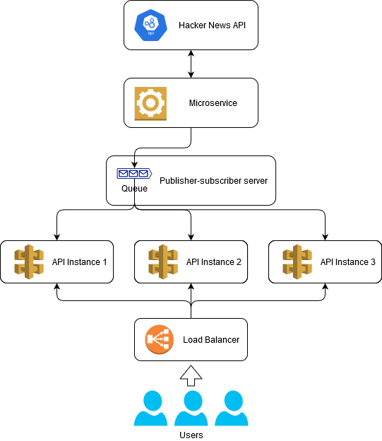

# Hacker News API
This API will consume the Hacker News API and return the 20 best stories.

## Overview
- [1 API Analysis](#1-api-analysis)
    - [1.1 Conclusions](#11-conclusions)
    - [1.2 Decisions](#12-decisions)
- [2 Implementation](#2-implementation)
- [3 Missing in the implementation](#3-missing-in-the-implementation)
- [4 Run the Application](#4-run-the-application)
- [5 Future improvements](#5-future-improvements)

## 1 API Analysis
1. How many results the Best Stories URI returns?
    - After doing an http request to the API, it returned 200 results.

2. Do we know how the results are sorted?
    - Checking the [official api][1], I do not have a confirmation. After some API requests, confirmed that best ones are on top of the results. But since they are the best ones, they might change the same items order based on the algorithm that determines the best ones.

3. What type of implementation the HackerNews API has?
    - It is an API with the data stored in the Firebase service. Firebase is a realtime NoSQL database currently developed by Google. At the time of writing, there are no official way to use the realtime API with .NET Core / .NET 5.

4. Can I use the realtime updates offered by [Firebase][2]?
    - I could not find an [official Library][3] for .NET Core / .NET 5. An [answer][4] by an official Firebase developer (appears by the profile) on Stack Overflow, confirms that there is none available.

5. How frequently we are allowed to request data from the API?
    - It is not specified by the API documentation.

### 1.1 Conclusions
- I can not try to find which stories are new to the list and only get those after first request. Order might have changed and I can not trust the last one as starting point for the new.
- Stories have to be refreshed too to get their updates.
- Since we are not getting the latest objects (the best stories take some time to mature until they are marked as best), the realtime is not crucial. Besides that, the exercise specifies that the RESTful API should be used.

### 1.2 Decisions
- I am going to assume an update each minute to get the latest best stories list and each story details (the 20 best ones).
- The data is going to be cached locally on the implemented solution. Cache will be in two ways, memory and in a MongoDB instance.
    - This will allow the data to be cached and available when the application starts and the HackerNews API is not reachable. On start, data from MongoDB instance goes to the memory.
    - Since the data in memory will be JSON objects ready to be returned to the clients, MongoDB native storage in JSON format seems appropriate.
- A service will be implemented to run in the defined interval and request the data from HackerNews. After a successfully acquire of the information, it will update the memory and MongoDB caches.
- The exercise required .NET Core 2.2 that reached the end of life on 12/23/2019. Since the .NET 5 has been released, I choose this version because it is more recent and has support until [3 months after .NET 6 release (around February 2022)][5].

## 2 Implementation
- 'ApiController' responds to a GET request at "\<Base Url\>/Api/BestStories".
    - Gets the cached data from the 'CachedHackerNewsRepository'.
    - Responds with the Best Stories list if already cached from the Hacker News API.
    - Responds with HTTP status code 503 Service Unavailable if there is no data in the cache.

- 'HackerNewsApiService' and 'HackerNewsApiServiceWorker' are responsible to update the cache every 60 seconds.
    - Requests the data and sets the cache using the 'CachedHackerNewsRepository'.

- 'CachedHackerNewsRepository' is a Repository using the Decorator Pattern.
    - Has the implementation to consume the 'HackerNewsApiRepository' and set the cache data.
    - Has the implementation to access the cached data.

- 'HackerNewsApiRepository' has the implementation to request the data from the Hacker News API.

- NOTE: Tried to follow the Clean Architecture. The single project structure has some main directories that would be extracted to separate projects.

## 3 Missing in the implementation
Unfortunately, due to time constraints and the deadline, the following tasks are missing from the implementation as initially planned:

- Unit tests are not completed.
- Clean Architecture implementation not completed.
- Desired MongoDB for persistence cache to allow the API to start and have some data if the Hacker News API is not available.

## 4 Run the Application
The project 'Api' inside the solution is a WebApi project. Compile and run this project using, for example, an IDE of your choice.

## 5 Future improvements
- Implementation of Continuous Integration and Continuous Delivery.

- The exercise mentioned that a large number of requests has to be served without overloading the Hacker News API. A reference number was not provided. The implementation solves the problem specified. But, it might need some extra adjustments to serve a large number of requests. Since there is always space for more improvement if needed, it is possible to do the following changed to allow multiple API instances behind a load balancer:
    - To allow this API to serve an exponential number of clients, I would change the infrastructure to allow multiple instances of this API.
    - Implementation of a Microservice responsible to query the Hacker News API and send the data to all API instances trough a Publisher-subscriber server. This would allow to avoid all API instances to ask for more recent data to the Microservice. The Microservice would send to them all the data as soon as it is obtained.
    - The final infrastructure would be something similar to the next image:
    

[1]: https://github.com/HackerNews/API
[2]: https://firebase.google.com/docs/database
[3]: https://firebase.google.com/docs/libraries/
[4]: https://stackoverflow.com/a/10729948
[5]: https://dotnet.microsoft.com/platform/support/policy/dotnet-core
